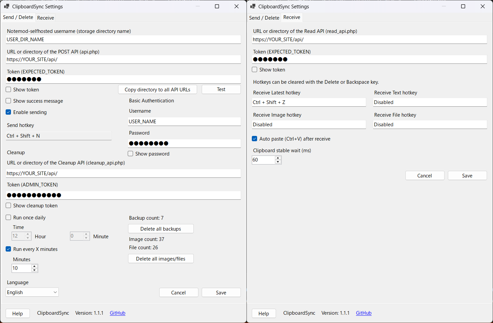

 <!-- README HEADER START -->
<div align="center">

# ClipboardSync

<p>
  Notemod-selfhosted と連携して、Windows のクリップボードを送受信できる軽量トレイ常駐アプリです。
</p>

<p>
  <a href="https://github.com/StayHomeLabNet/ClipboardSync/releases">
    
  </a>
  <a href="https://github.com/StayHomeLabNet/ClipboardSync/blob/main/LICENSE">
    
  </a>
  
  
</p>

<p>
  <a href="./README.md">English</a>
  ·
  <a href="https://github.com/StayHomeLabNet/ClipboardSync/releases">Releases</a>
  ·
  <a href="https://github.com/StayHomeLabNet/ClipboardSync/issues">Issues</a>
</p>

</div>
<!-- README HEADER END -->

## 概要

ClipboardSync は、Windows のクリップボード内容を Notemod-selfhosted と連携して送受信するための、Windows トレイ常駐アプリです。

現在は **テキスト / 画像 / ファイル** の送信と受信に対応しています。

Notemod-selfhosted（サーバー） + ClipboardSync + iPhone のショートカット / 背面タップ / アクションボタン等で、

    iPhone でコピーした文字列を、Windows 側でホットキーを1回押すだけで貼り付けまで完了

という使い方を想定しています。

## バージョン

**ClipboardSync v1.1.1**



## 主な機能

### 送信
- クリップボードの **テキスト** を `api.php` に送信
- クリップボードの **画像** を `api.php` に送信
- クリップボードの **ファイル** を `api.php` に送信
- トレイ常駐で常時監視
- 送信の ON / OFF 切り替え
- 送信成功時メッセージ表示の ON / OFF

### 受信
- **最新を受信ホットキー**
- **テキストを受信ホットキー**
- **画像を受信ホットキー**
- **ファイルを受信ホットキー**
- 受信後に Windows のクリップボードへセット
- 必要に応じて **Ctrl+V 自動貼り付け**

### Cleanup / 管理
- `cleanup_api.php` を使った **INBOX 全削除**
- **バックアップ件数表示**
- **画像件数表示**
- **ファイル件数表示**
- **バックアップ全削除**
- **画像・ファイル全削除（メディア全削除）**
- 毎日 1 回、または一定分ごとの自動 cleanup

### UI / 操作
- Windows トレイ常駐
- 英語 / 日本語 / Türkçe 対応
- ホットキーは **Delete または Backspace** で解除可能
- POST API 欄から `/api/` ディレクトリを抽出して、Read API URL / Cleanup API URL にコピーする補助ボタン
- URL はディレクトリ入力にも対応
- Notemod-selfhosted マルチユーザー版向けの保存先ディレクトリ名入力欄に対応

## 動作環境

- Windows 10 / 11
- .NET 8 ベースの Windows Forms アプリ
- Notemod-selfhosted 側に以下の API があること
  - `api.php`
  - `read_api.php`
  - `cleanup_api.php`

## インストール
- GitHub Releases から最新版をダウンロード
- EXE を起動
- トレイメニューの **設定** から URL / token を入力

## アンインストール
- EXE を削除
- `C:\Users\<ユーザー名>\AppData\` から、`ClipboardSync` というフォルダーごと削除

## 開発者向け（アーキテクチャ・プロジェクト構成）
本プロジェクトは、保守性と拡張性を高めるため、機能ごとにディレクトリを分割したモジュラーアーキテクチャを採用しています。

ClipboardSync v1.1.1 では、**画像送受信・ファイル送受信・最新を受信ホットキー・メディア削除・URL 正規化対応・Notemod-selfhosted マルチユーザー対応** が含まれています。

- `Api/`  
  HTTP 通信処理を担当します。  
  `Sender.cs`、`Receiver.cs`、`CleanupApi.cs`、`ConnectionTester.cs` などを配置し、送信・受信・cleanup・接続確認を分担しています。  
  **テキスト / 画像 / ファイル送信**、**テキスト / 画像 / ファイル受信**、`latest_clip_type` を利用した **最新を受信ホットキー**、**API URL の自動正規化**、およびマルチユーザー環境向けの `user=...` クエリ付与に対応しています。

- `Models/`  
  設定やデータ構造を管理します。  
  `AppSettings.cs` に、送信設定、cleanup 設定、受信設定、複数の受信ホットキー設定、Basic 認証情報、言語設定、Notemod-selfhosted の保存先ディレクトリ名などを保持します。

- `Native/`  
  Windows API、クリップボード操作、ホットキー制御を担当します。  
  `ClipboardWatcherForm.cs`、`ClipboardUtil.cs`、`PasteHelper.cs` などを配置しています。  
  **テキスト / 画像 / ファイルのクリップボード監視**、**ホットキーの複数登録**、**Delete / Backspace によるホットキー解除**、および **受信後の再送信ループ防止** を支える処理が含まれます。

- `Services/`  
  アプリケーションロジックや共通機能を担当します。  
  `SettingsStore.cs`、`CleanupScheduler.cs`、`I18n.cs`、`AppInfo.cs`、`EmbeddedIcon.cs` などを配置しています。  
  設定保存、定期 cleanup、多言語化、アプリ情報取得などを担っています。

- `UI/`  
  設定画面やトレイ常駐アプリの UI 制御を担当します。  
  `TrayAppContext.cs`、`SettingsForm.cs`、`SettingsForm.Layout.cs` などを配置しています。  
  主に **送信 / 削除タブ** と **受信タブ** に対して、
  - 最新を受信ホットキー
  - テキスト / 画像 / ファイル受信ホットキー
  - ホットキー解除説明ラベル
  - 「ディレクトリをすべてのAPI URLにコピー」ボタン
  - 画像件数 / ファイル件数表示
  - Notemod-selfhosted のユーザー名（保存先ディレクトリ名）入力欄
  などの UI 拡張が行われています。

※ 設定画面（`SettingsForm`）は partial class を用いて、**レイアウト（見た目）** と **ロジック** を分離しています。  
これにより、UI 配置の調整と動作実装を分けて保守しやすくしています。

※ ClipboardSync は、**テキスト / 画像 / ファイル** を扱う **双方向クリップボード同期クライアント** です。

## API 側の前提

### 書き込み
ClipboardSync は、送信時に `api.php` を使用します。

対応内容:
- text
- image
- file

### 読み取り
ClipboardSync は、受信時に `read_api.php` を使用します。

使用する action:
- `action=latest_note`
- `action=latest_image`
- `action=latest_file`
- `action=latest_clip_type`

### cleanup
ClipboardSync は、削除や件数確認に `cleanup_api.php` を使用します。

使用する主な操作:
- `category=INBOX`
- `purge_bak`
- `purge_images`
- `purge_files`
- `purge_media`
- `dry_run=2`
- `action=backup_now`

## Notemod-selfhosted マルチユーザー対応

設定画面に、次の項目があります。

- **Notemod-selfhostedのユーザー名（保存先ディレクトリ名）**

動作:
- この欄が未入力のときは、従来どおり動作します
- この欄に値が入っているときは、すべての API 呼び出しに `user=<DIR_USER_NAME>` を追加して送信します

例:

```text
https://stayhomelab.net/notemod/api/read_api.php?token=5335444&user=takeshi&action=latest_clip_type
```

対象:
- 送信
- 受信
- cleanup
- 接続テスト

## URL 入力仕様

各 URL 欄は、次のどれを入力しても内部で自動補正されます。

### 送信 URL / 接続テスト
以下のどれでも入力可能です。
- `https://example.com/notemod/api/`
- `https://example.com/notemod/api`
- `https://example.com/notemod/api/api.php`
- `https://example.com/notemod/api/read_api.php`
- `https://example.com/notemod/api/cleanup_api.php`

送信時と接続テスト時には、自動で `api.php` に正規化されます。

### Read API URL
以下のどれでも入力可能です。
- `https://example.com/notemod/api/`
- `https://example.com/notemod/api`
- `https://example.com/notemod/api/api.php`
- `https://example.com/notemod/api/read_api.php`
- `https://example.com/notemod/api/cleanup_api.php`

受信時には、自動で `read_api.php` に正規化されます。

### Cleanup API URL
以下のどれでも入力可能です。
- `https://example.com/notemod/api/`
- `https://example.com/notemod/api`
- `https://example.com/notemod/api/api.php`
- `https://example.com/notemod/api/read_api.php`
- `https://example.com/notemod/api/cleanup_api.php`

cleanup 時には、自動で `cleanup_api.php` に正規化されます。

## 最新を受信ホットキー

**最新を受信ホットキー** は、`read_api.php?action=latest_clip_type` の戻り値を見て、何を受信するかを自動判定します。

判定ルール:
- `type = note` → `action=latest_note`
- `type = image` → `action=latest_image`
- `type = file` → `action=latest_file`

これにより、サーバー上の最新クリップボードがテキスト・画像・ファイルのどれであっても、1つのホットキーで受信できます。

## 設定画面

### Send / Delete タブ
- Notemod-selfhosted のユーザー名（保存先ディレクトリ名）
- POST API (`api.php`) の URL またはディレクトリ
- Token
- 接続テスト
- ディレクトリをすべてのAPI URLにコピー
- 送信有効 / 無効
- 送信成功メッセージ表示
- 送信ホットキー
- Basic 認証
- Cleanup API URL
- Cleanup Token
- 自動 cleanup 設定
- バックアップ件数
- 画像件数
- ファイル件数
- バックアップ全削除
- メディア全削除
- 言語設定

### Receive タブ
- Read API URL
- Token
- ホットキーは Delete または Backspace で解除可能
- 最新を受信ホットキー
- テキストを受信ホットキー
- 画像を受信ホットキー
- ファイルを受信ホットキー
- 自動貼り付け
- クリップボード安定待ち時間

## ホットキーについて

- 修飾キー付きのホットキーを設定できます
- 例: `Ctrl + Alt + R`
- **Delete** または **Backspace** を押すと、そのホットキー欄を解除できます
- 解除されたホットキーは **Disabled** と表示され、登録されません

## 送信される内容の優先順位

クリップボード監視時は、次の優先順位で判定されます。

1. ファイル
2. 画像
3. テキスト

つまり、ファイルが入っている場合は画像やテキストより優先して送信対象になります。

## ループ防止

受信した内容をローカルのクリップボードへセットしたあと、その変更が再送信されてしまわないように抑止処理が入っています。

これにより、
- 受信
- ローカルに反映
- その内容を再送信
- また受信

という無限ループを防いでいます。

## 自動貼り付けについて

受信後の自動貼り付けは、内部的に `Ctrl+V` を送る方式です。

注意:
- 管理者権限で動いているアプリには貼り付けできない場合があります
- 貼り付け先アプリの状態によっては失敗する場合があります

## Basic 認証

必要に応じて Basic 認証付きの API に接続できます。

設定項目:
- Username
- Password

## 設定保存

設定は Windows ユーザーごとに保存されます。  
トークンや Basic 認証パスワード、cleanup token などは DPAPI を用いて暗号化されます。

## v1.1.1 の主な追加・強化点

v1.1.0 からの主な差分:

- Notemod-selfhosted マルチユーザー対応を追加
- Notemod-selfhosted のユーザー名（保存先ディレクトリ名）設定欄を追加
- Sender / Receiver / Cleanup / ConnectionTester に、必要時のみ `user=...` を付与する処理を追加
- 新しい設定欄が未入力のときは、従来通りの動作を維持
- 文言や細部の調整

## トラブルシュート

### 送信はできるのに接続テストが失敗する
接続テスト用の URL 正規化、Basic 認証設定、Notemod-selfhosted のユーザー名欄を確認してください。

### ファイル受信時に名前が期待通りにならない
`latest_clip_type` のレスポンス内に `file.original_name` が含まれているか確認してください。

### 画像 / ファイル件数が取得できない
`cleanup_api.php` 側で `purge_images` / `purge_files` / `dry_run=2` に対応しているか確認してください。

### 自動貼り付けが動かない
貼り付け先アプリの権限やフォーカス状態を確認してください。

## ライセンス

必要に応じて、このリポジトリに設定しているライセンスに従ってください。

## リンク

- GitHub: https://github.com/StayHomeLabNet/ClipboardSync
- Help: https://stayhomelab.net/Clipboardsync
- Notemod-selfhosted: https://github.com/StayHomeLabNet/Notemod-selfhosted
